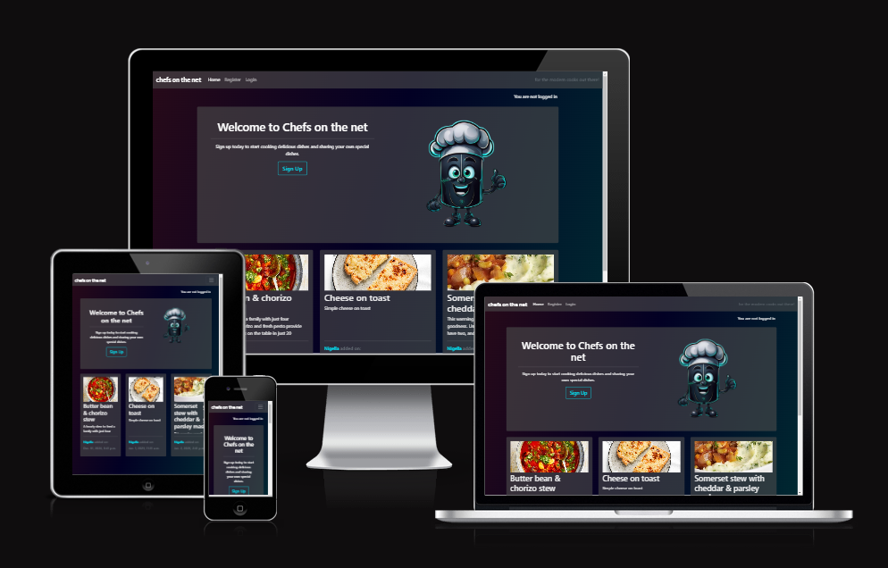
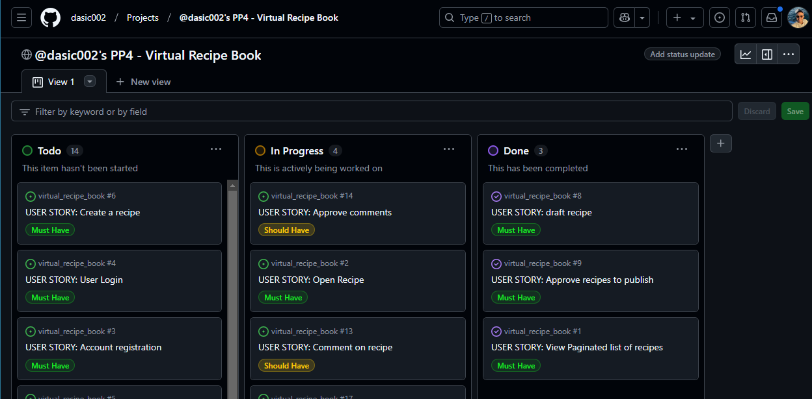
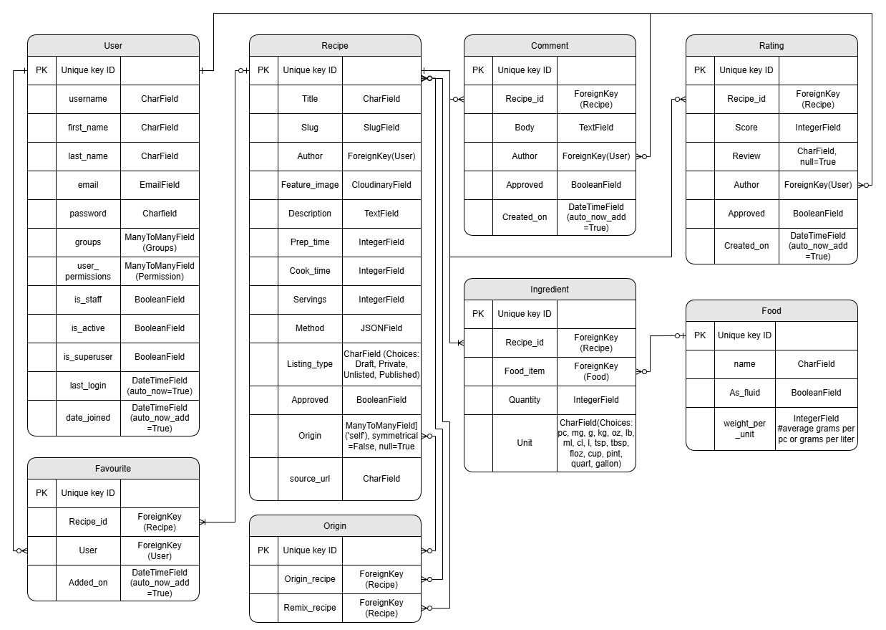
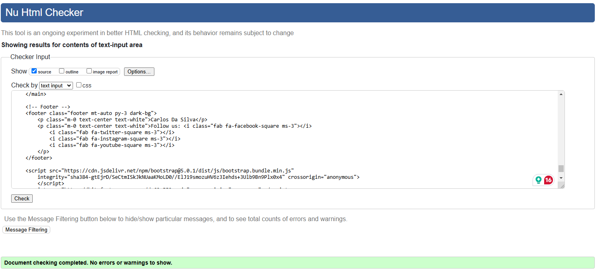
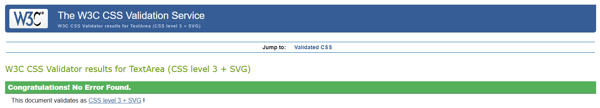
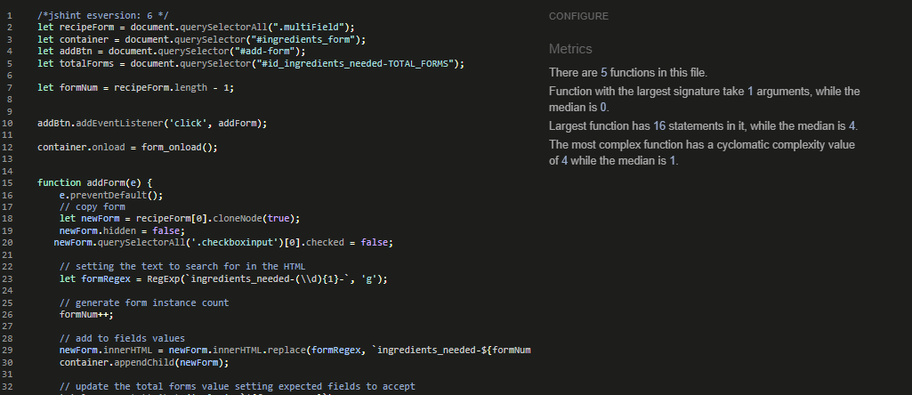
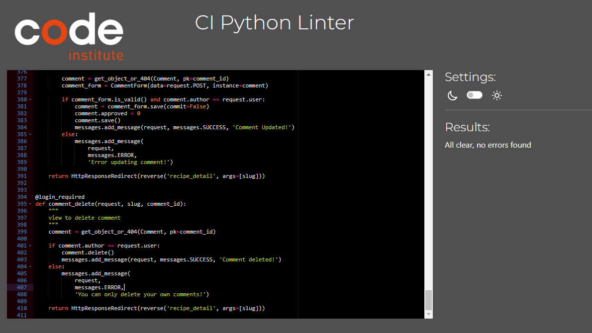
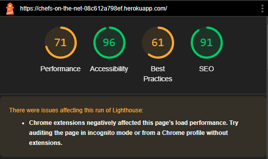
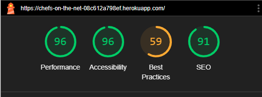

# Chefs on the net
For my fourth portfolio project with Code Institute, I built a full stack application of a digital recipe book using Django's framework.

Chefs on the net caters for the self made chefs that want to move their recipe books to a digital platform where users can collate their recipes for personal use and/or share with other users on our website. Create a community where users can can comment, rate and even personalise the recipes with their own twist. 

Only registered users have access to the recipes shared on the site and the rest of its features, such as creating recipes, submitting comments, ratings and adding recipes to their favourites.

Recipes require approval from the superuser to listing the recipe for general viewing on the site, but comments and ratings can can be approved by the recipe owners.

The home page whilst a user is logged in, will display the library of public recipes available, whilst in "My recipes" page, users can view their own recipes and more easily review comments and ratings on their recipes.


[View the deployed webapp here](https://chefs-on-the-net-08c612a798ef.herokuapp.com/)

[View the Agile project here](https://github.com/users/dasic002/projects/6)



***

## Table of contents
<!-- * [UX User Experience](#ux---user-experience)
  * [User stories](#user-stories)
  * [Flowchart](#flowchart)
  * [Strategy](#strategy)
  * [Scope](#scope)
  * [Surface](#surface)
* [Features](#features)
* [Technologies](#technologies)
* [Testing](#testing)
* [Deployment](#deployment)
* [Credits](#credits) -->


***


## UX - User Experience

### User stories
#### New Visitor
- Upon reaching the website I want to understand what the site does
- I want to see some content before registering
- I want to easily navigate the site to register or find social media links
- I want to easily sign up and start using the site

#### Registered User
- I want to login and logout easily
- I want to be able to delete my account
- I want to be able to reset my password should I forget it
- I want to be able to create/edit/delete my recipes
- I want to be able to create/edit/delete my comments on recipes
- I want to be able to create/edit/delete my rating on recipes
- I want to be able to add and remove a recipes from my favourites
- I want to be able to review comments and ratings from other user on my recipes
- I want to be able to easily copy an existing recipe to make my own tweaks to it
- I want to be able to submit new food items for approval should they not exist in the database

#### All Users
- I want to be able to easily navigate the site regardless of display size
- I want to get feedback on actions taken on the website
- I want to be able to contact the site admin
- I want to see recipe details when I click on it
- I want to be advised if a page I navigated to no longer exists and easily return to the site


### Strategy
Start with an MVP and build on desirable features, to create a simple and cool website the users will want to visit time and time again.

### Scope
This Project was created using the Agile methodology. It allowed me to focus on the **MUST HAVE** features before working on the following graded by the [MoSCoW Method](https://en.wikipedia.org/wiki/MoSCoW_method).

These features were planned as User stories in GitHub Issues and displayed using a [Kanban](https://en.wikipedia.org/wiki/Kanban_(development)) board template in GitHub Projects.

Each issue expands on the user intent, our Acceptance Criteatia and Tasks to build the feature.



__Must have features:__
- CLOSED - [](https://github.com/dasic002/virtual_recipe_book/issues/8)
- CLOSED - [](https://github.com/dasic002/virtual_recipe_book/issues/9)
- CLOSED - [](https://github.com/dasic002/virtual_recipe_book/issues/1)
- CLOSED - [](https://github.com/dasic002/virtual_recipe_book/issues/2)
- CLOSED - [](https://github.com/dasic002/virtual_recipe_book/issues/22)
- CLOSED - [](https://github.com/dasic002/virtual_recipe_book/issues/4)
- CLOSED - [](https://github.com/dasic002/virtual_recipe_book/issues/5)
- CLOSED - [](https://github.com/dasic002/virtual_recipe_book/issues/3)
- CLOSED - [](https://github.com/dasic002/virtual_recipe_book/issues/6)
- CLOSED - [](https://github.com/dasic002/virtual_recipe_book/issues/7)
- CLOSED - [](https://github.com/dasic002/virtual_recipe_book/issues/23)
- CLOSED - [](https://github.com/dasic002/virtual_recipe_book/issues/24)

__Should have:__
- CLOSED - [](https://github.com/dasic002/virtual_recipe_book/issues/13)
- CLOSED - [](https://github.com/dasic002/virtual_recipe_book/issues/15)
- IN PROGRESS - [](https://github.com/dasic002/virtual_recipe_book/issues/14)
- OPEN - [](https://github.com/dasic002/virtual_recipe_book/issues/11)

__Could have:__
- CLOSED - [](https://github.com/dasic002/virtual_recipe_book/issues/17)
- OPEN - [](https://github.com/dasic002/virtual_recipe_book/issues/10)
- OPEN - [](https://github.com/dasic002/virtual_recipe_book/issues/12)
- OPEN - [](https://github.com/dasic002/virtual_recipe_book/issues/16)
- OPEN - [](https://github.com/dasic002/virtual_recipe_book/issues/18)

__Won't have:__
- OPEN - [](https://github.com/dasic002/virtual_recipe_book/issues/19)
- OPEN - [](https://github.com/dasic002/virtual_recipe_book/issues/20)
- OPEN - [](https://github.com/dasic002/virtual_recipe_book/issues/21)


### Structure
A multi page including Account Management and Blog like pages to navigate and manage Recipes. The page is composed of the following sections:
- **Header** - Contains title of the page.

- **Menu** - Navigation links included in the header, but collapse into the hamburger/bars icon on smaller displays, either are always visible in the header.

- **Home** - The first page any visitor lands on, includes a banner section welcoming the visitor and inviting them to sign up, should the visitor not be logged in. The page includes 3 recipes the anonymous user is free to browse. Once the user is signed up and logged in, the same page turns into the Library of published recipes the user is able to browse. Includes Recipe widgets and Page navigation widget.

  - **Recipe widget** - Reusable section containing image, Clickable Title, description and Clickable Author name.

  - **Page navigation widget** - Reusable section containing the pagination buttons to navigate libraries of recipes.

- **My recipes** - Another Library view for recipes the current user has created. Includes Recipe widgets, Page navigation widget, Add recipe button to link the user to a Create recipe form, Edit and delete buttons within the recipe widget to allow the user to edit the recipe or delete it. Deletion of recipe requires confirmation via a modal before execution.

- **User Library** - Accessible when the user click on the author's username on the recipe widget. It forwards the user to the same view as **My Recipes** filtering with the given Author's recipes, but excludes any Add/Edit/Delete Recipe buttons.

### Wireframes
- [Landing page](docs/wireframes/01_landing_page.jpg)
- [Navbar and footer](docs/wireframes/02_navbar_and_footer.jpg)
- [Login page](docs/wireframes/03_login.jpg)
- [Signup page](docs/wireframes/04_sign_up.jpg)
- [Logout page](docs/wireframes/05_logout.jpg)
- [Recipes library page](docs/wireframes/06_recipes_library.jpg)
- [My recipes page](docs/wireframes/07_my_recipes.jpg)
- [Recipe details page](docs/wireframes/08_recipe_details.jpg)
- [New recipe page](docs/wireframes/09_new_recipe.jpg)

### Surface
#### Colour theme
Considering the theme of Chefs gone digital, was inspired too use a sort of Neon/Cyberpunk colour theme.


#### Typography
Google Fonts included:
- Roboto
- Lato

## Features 

<!-- ### Existing Features
#### Welcome
Upon the game loading, the terminal will display a simple Heading "Welcome to Wordle", with only a prompt at the bottom of the interface for the user to enter their name. This is to keep the interface as simply and least daunting as possible before the player begins the game.<br>
  

#### New game display
Once the player has input a name the terminal generates the user variables and word selection and presents the game in the CLI after clearing the welcome display away.

__Note:__ If the play simply pressed enter without entering a name, the game will use the default of "Player-1".

The display will include:
  1) a personalised message of "Welcome, _player name_".
  2) an instruction how to bring up the rules of the game.
  3) blank guess lines shown as a series of asterisks __` *  *  *  *  * `__.
  4) prompt for player to enter their guess.<br>
  
 -->
  
<!-- #### Player Prompt
The game prompts the player to take a guess, provided it passes the validation checks, the game checks the input guess against the randomly selected word for this session. Every time the guess is incorrect the prompt changes to "Oops! That guess is wrong. You have {number} of guess(es) left.".

 -->

<!-- #### Invalid guess inputs display
To reduce frustrations over incorrect guesses we have put in place some input validations, as well as adding a `strip()` method to the guess input so should the user enter a whitespace before or after typing their word, it will not trigger the validation checks for a seemingly valid guess.

##### Invalid data: not exactly 5 characters long
This first check verifies the guess is only 5 characters long, not shorter or longer. In the chance the player enters a guess that fails this check the game prints out the game display again but with the message advising the guess was invalid and explaining why so.


##### Invalid data: includes characters not in the alphabet
Should the guess input pass the 5 characters long verification, the next check verifies that no characters other than letters in the alphabet have been used. Should the player enter punctuation marks, numbers or other special characters, the game will refresh and display the error message explaining why the last entered guess was not valid.


##### Invalid data: is not a word in the dictionary used
Finally, after passing the other checks, the last check verifies that the input is a word included in our dictionary. Should it not be included in the dictionary, it will refresh the game and advise the word is not in the dictionary.

 -->

<!-- #### Clues on guesses made
The objective of wordle is that the player gets given clues on all guesses so the player can deduce what the selected word is. In our version of the game:
- Blank lines are shown as plain text asterisks ` * `.
- Letters not existing in the selected word are shown in a dark grey background - these tell the player to avoid using these letters in future guesses.
- Letters existing in the selected word but in the incorrect place are shown in a bright yellow background - these tell the player to try words where this letter is in another place.
- Letters existing in the selected word and in the correct place are shown in a green background - these tell the player to try words where this letter is as it is.

#### End of Round
The round ends when the player has either guessed the selected word or has failed to do so after 6 attempts.
##### Correct guess
On guessing the word, the terminal prints out "Nicely done, _player name_!" and confirms the word of the day.


##### 6 Wrong guesses
On 6 failed attempts, the terminal prints out "GAME OVER", reveals the word of the day and "Oh no, _player name_! You've lost this streak!".


##### Scores
In either case the game will keep track of the score, namely the consecutive number of times the player has guessed the word correctly. Should it be the maximum the player has managed to get in this session, the game will record it as a high score. Should the player, win the game, the "Current streak" counter increments by 1, if the game was lost, it resets to 0.

The game will also calculate and display the average number of guesses the player has needed to guess the word of the day. It will also look up the player's longest winning streak and rank the player against the other game sessions recorded.


##### Inviting for a new game
At the end of the round, the game prompts the player for another game. If the player inputs anything but "n" or "N", a new round will start with a new word of the game. Should the player have had enough, they'll enter "n" or "N" for No to exit the game. On doing so a message thanking the player for playing will be printed out.


#### Game rules display
Should the player need to be reminded of the rules, the player can enter "help!" as a guess input. This will bypass the usual validations and cause the game to print the rules on a clear terminal and request a prompt just to press 'Enter' when done with the game for when the player feels ready to resume the game.

 -->

### Data Models
Chefs on the Net app uses a relational database to store and manage data. The relational database management system software used was PostgreSQL and was hosted on [Code Institute service](https://dbs.ci-dbs.net/).

#### Entity Relationship Diagram




<!-- ### Features Left to Implement
These features were not implemented just so I did not get distracted with a feature creep and not deliver on my MVP.

#### __Alphabet checklist__
The official Wordle game includes the whole keyboard in the display, highlighting which letters have not been used, which are non-existing in the word of the day and existing or correctly placed. This helps the player visualise which letters they could use on their next guess much like a checklist of the alphabet. It becomes easier to try sounding out words for the next guess without using the letters the game has rules out. 

__How might we create this?__
We have not recreated this feature, but we could potentially use the empty space to the right of the guesses to print out the alphabet and highlighting what letters are still available to use. This would probably be done as dictionary variable, where the alphabet forms the keys and the values are the same as used for listing out the clues in a guess ('-' for unused/unchecked, 'X' for not in word of the day, 'O' for exist in Word of the day, 'C' is in the correct place of the word of the day).


#### __Hard Mode gameplay__
Wordle includes __Hard Mode__ which tracks letters the player has guessed that exist in the selected word and should the player not use them in the next guess they attempt, wordle will not accept the entry. Should the letter be in the correct place, wordle will only accept words with the correctly guessed letters in the same places. 

For example, should the word of the day be __LIVER__ and:
1) the first guess be __PLATE__, then __L__ and __E__ are indicated as exiting but being in the wrong place, the second guess would need to include both __L__ and __E__, so it could __not__ be something like _NERVE_ or _LOUSY_, but could be _LIKED_ or _LOVER_.
2) Should the second guess in fact be __LIKED__, the letters __L__, __I__ and __E__ will be indicated as correctly guessed and need to be used in the same places for the following guess, something looking like __L I _ E _.__, which could be LIFER, LIMEN, LINEN, LINER, LIVED, LIVER just to name a few. 

The aim of this feature is to avoid the player trying completely different words to find other missing letters without the constraints of considering the words that the word of the day could be with the clues given. For instance, without __Hard Mode__ the player's second guess could be __VIRUS__ (after 1st as __PLATE__), it doesn't include __L__ and __E__ that would have been highlighted from _PLATE_, but does include __V__, __I__ and __R__. 

From those 2 guesses, the player should be able to deduce that the word of the day is __LIVER__ on the third guess. 

__How might we create this?__
If we were to implement this feature, we could store the list output from the evaluation of previous guesses to use in a validation of input and comparing the previously correct guessed letter placement matching that in the new guess. 
For letters existing in the selected word, the function evaluating guesses can output a dictionary of these letters, and the input validation checks that these letters are used in the latest input before it proceeds to evaluating for the game. 


#### __Feedback messages__
Wordle has a feedback word for correctly guessing the word of the day at each attempt. Specifically, the following messages display guessing correctly at:
1) first attempt - __Genius__
2) second attempt - __Magnificent__
3) third attempt - __Impressive__
4) fourth attempt - __Splendid__
5) fifth attempt - __Great__
6) sixth attempt - __Phew__

__How might we create this?__
These messages could have been a constant variable as a list and upon winning the round, the message is composed calling the list item by index. The index would be calculated with the length of the list of guesses made minus 1.


#### __Returning players login__
Playing the official Wordle game the game recognises the devices, so as the player returns day after day it can track the player's stats. For extended features, players can register an account with New York Times to access other games too. The benefit is that a returning player can keep building on their winning streak to overcome their own high score (longest streak) without having to play more rounds in one single session of accessing the game.

__How might we create this?__
The most feasible way I can think of is to either:
- provide new players their timestamp based ID after entering their name so that next time they access the game, if it is entered in the name prompt of the welcome page, the game can recognise the input is all numeric and 12 digits long, which makes the game lookup the number as an ID, if it exists in our worksheet it will pull the data into the game and allow the next round, if won to increment the current winning streak as if the player had not closed the previous game.
- or that when new players enter their name on the welcome page prompt, the game asks the player to provide a unique username and password, with the game confirming that the username is valid and available in the worksheet. Next time the player returns, when prompted for a name, the player can enter their username, the game looks up the usernames in the worksheet and prompts for a password, before it resumes the game with the same stats.  -->


## Technologies
- Languages used:
  - [HTML5](https://en.wikipedia.org/wiki/HTML5)
  - [CSS3](https://en.wikipedia.org/wiki/CSS)
  - [JavaScript](https://en.wikipedia.org/wiki/JavaScript)
  - [Python](https://en.wikipedia.org/wiki/Python_(programming_language))
  - [Bootstrap](https://getbootstrap.com/docs/5.0/getting-started/introduction/)
  - [Django](https://docs.djangoproject.com/en/5.0/)
- [Draw.io](https://app.diagrams.net/#) - a free web-based diagram drawing tool.
- [GitPod](https://www.gitpod.io/) - Cloud-based IDE to edit code and Git version control.
- [GitHub](https://github.com/) - to store and publish the project.
- [Am I Responsive](https://ui.dev/amiresponsive) - to visualise the website in various display sizes.
- [PEP8 guide](https://peps.python.org/pep-0008/) - for guidance on python formatting standards. 
- [Code Institute's Python linter](https://pep8ci.herokuapp.com/) - to validate the Python code. 
- [Heroku](https://dashboard.heroku.com/) - for deployment of our web app.

## Testing 

### Validator Testing 

- HTML
  - No errors were returned when passing through the official, just warnings on use of aria-labels on span elements. These span elements are the cards in the first step of the "How To Play" breaking down the value each card has, aria labels were added to make the site more accessible with the ability to describe the value of the card. [W3C validator](https://validator.w3.org/nu/)<br>
  
- CSS
  - No errors were found when passing through the official [(Jigsaw) validator](https://jigsaw.w3.org/css-validator/)<br>
   
- JavaScript
  - No errors were found when passing through [JS hint error checker](https://jshint.com/)<br>
  
- Python
  - No errors were found [Code Institute's Python linter](https://pep8ci.herokuapp.com/) - to validate the Python code.<br>
  

- Accessibility
  - Running the site through lighthouse analysis does show some issues with some insuficient colour contrast and performance suggests I should minimise my JS files for faster loading. Otherwise still rates above 90 on accessibility:
    - Mobile:<br>
  
 
    - Desktop:<br>
  

  - Running the site through [WAVE accessibility tool](https://wave.webaim.org/report#/https://dasic002.github.io/GameOfKings/index.html) showed no obvious errors after some improvements were made.<br>
  


### Manual Testing

#### Devices and browsers used
- iPhone 12 Pro - iOS 18.1.1
  - Safari (v18.1.1)
  - Chrome (v131)

- iPad Pro (12.9 inch - 4th Gen) - iPadOS 18.1.1
  - Safari (v18.1.1)
  - Chrome (v131)

- Dell Precision 3510 laptop - Windows 10 Pro (2H22)
  - Chrome (v131)

#### Manual testing checklist

| Feature | Action | Expected Behaviour | Pass/Fail | Notes |
|-|-|-|-|-|
|Google fonts|Loading the page|Google fonts load|PASS|
|Font awesome icons|Loading the page|Icons appear as intended|PASS|
|Images|Loading the page|images appear as intended|PASS|
|content text |Loading the page|text appears as intended|PASS|
|Nav bar appearance|Loading the page|Nav bar appears as expected, collapsed hamburger icon for narrow displays|PASS|
|Nav Button - hamburger icon|Click Hamburger icon|hamburger icon toggles to reveal and collapse nav menu|PASS|
|Nav button - Register|Click button "Register" just after loading the site|Loads sign up page|PASS|
|Nav button - Login|Click button "Login" just after loading the site|Loads login page|PASS|
|Nav button - Logout|Click button "Logout" after starting a game|Loads logout confirmation page|PASS|
|Nav Button - Logout|Click button "Sign out"|Confirms logging out and returns to Home page|PASS|
|Nav Button - Home|Click button "Home"|Loads to Home as either welcome or library dependant on login status|PASS|
|Nav Button - My Recipes|Click button "My Recipes"|Loads Logged in user's recipe library to view and manage their recipes|PASS|
|Page scaling - mobile|Viewing the page on mobile display in portrait|Font size is legible and the page does not require scrolling on timed buttons. No overlapping text or images.|PASS|
|Page scaling - mobile|Viewing the page on mobile display in landscape|Font size scales down to fit in the height of the display. Page includes left and right margins to keep content in the centre still.|PASS|
|Page scaling - desktop|Viewing the page on a desktop/laptop display in landscape with the browser taking the width of the display|Font size scales down to fit in the height of the display. Page includes left and right margins to keep content in the centre still.|PASS|
|Page scaling - desktop|Viewing the page on a desktop/laptop display in landscape with the browser taking the width of the display|Font size scales down to fit in the height of the display. Page includes left and right margins to keep content in the centre still.|PASS|
|Error 403 page|Enter existing url user is not allowed to access for the site|Calls up custom 403.html|PASS|
|Error 403 page|Click on the Home button|Brings viewer back to main page|PASS|
|Error 404 page|Enter non-existing url for the site|Calls up custom 404.html|PASS|
|Error 404 page|Click on the Home button|Brings viewer back to main page|PASS|
|Error 500 page|Browse site when a function in view has been disabled|Calls up custom 500.html|PASS|
|Error 500 page|Click on the Home button|Brings viewer back to main page|PASS|


### Bugs

<!-- - __ANSI escape 8-bit colours not visible on Heroku - FIXED__<br>
Heroku allows for colours in its app, but these are restricted to 3-bit and 4-bit, so have selected colours from that selection instead.

- __Dictionary includes words with the character "ƒ" - FIXED__<br>
This character appeared on words that should have ended with an accented e (é), like __sauté__. For ease of playing the game this character has been replaced with a plain "e". -->


## Deployment
### Local Development

#### Forking the Repository

- Log in to GitHub.
- Go to the repository for this project (<https://github.com/dasic002/virtual_recipe_book>).
- In the top-right corner of the page, click "Fork".
- Under "Owner", select an owner for the repository from the dropdown menu.
- Optionally, in the "Description" field, type a description of your fork.
- To copy the main branch only, select the "Copy the main branch only" check box. If you do not select this option, all branches will be copied into the new fork.
- Click "Create fork"

#### Cloning Your Forked Repository

- Log-in to GitHub.com, navigate to your fork of the repository.
- Above the list of files, click Code.
- Copy the URL for the repository.
  - To clone the repository using HTTPS, under "Clone with HTTPS", click the "Copy" icon.
  - To clone the repository using an SSH key, including a certificate issued by your organization's SSH certificate authority, click SSH, then click the "Copy" icon.
  - To clone a repository using GitHub CLI, click Use GitHub CLI, then click the "Copy" icon.
- Open Git Bash
- Change the current working directory to the location where you want the cloned directory.
- Type git clone, and then paste the URL you copied earlier.
- Press Enter. Your local clone will be created.

For more details about forking and cloning a repository, please refer to [GitHub documentation](https://docs.github.com/en/get-started/quickstart/fork-a-repo).

#### Install Dependencies

Use the `pip install -r requirements.txt` command to install all of the Python modules and packages listed in your requirements.txt file.

#### Create your env.py

- In your project workspace, create a file called env.py and make sure this file is included in the .gitignore file.
- Add the following code:

```python
import os

os.environ["DATABASE_URL"]='<copiedURL>'
os.environ['SECRET_KEY'] = '<ADD YOUR SECRET KEY HERE>'
os.environ['CLOUDINARY_URL'] = '<API ENVIRONEMENT VARIABLE>'

```

- Replace `<ADD YOUR SECRET KEY HERE>` in the SECRET_KEY environment variable with your own secret key.
- Save the file.

#### Create a Database

- Create an account and log in with ElephantSQL.com.
- From the dashboard click “Create New Instance”.
- Set up your plan
  - Give your plan a Name
  - Select a plan tier
  - You can leave the Tags field blank
- Select “Select Region”
- Select a data center near you
- Then click “Review”
- Check your details are correct and then click “Create instance”
- Return to the ElephantSQL dashboard and click on the database instance name for this project
- In the URL section, click the copy icon to copy the database URL
- In your env.py file replace `<copiedURL>` in the DATABASE_URL environment variable with the copied URL.
- Save the file.

#### Set Up Cloudinary

- Create an account and log in with Cloudinary.com.
- In the dashboard copy your API Environment variable.
- In your env.py file replace `<API ENVIRONEMENT VARIABLE>` in the CLOUDINARY_URL environment variable with the copied API Environment variable.
- Save the file.

### Deployment

- The requirements.txt file in the project was updated to include details on the project dependencies. Steps to do this are :
  - Enter the following command at the terminal prompt : "pip3 freeze > requirements.txt"
  - Commit changes to requirements.txt and push to GitHub.
- In `setting.py`, add Heroku Hostname to ALLOWED_HOSTS.

```python
ALLOWED_HOSTS = ["PROJECT_NAME.herokuapp.com", "YOUR_HOSTNAME"]
```

- Make surea file named Procfile exists on the top level directory which contans the following code:

```python
web: gunicorn PROJECT_NAME.wsgi
```

- Commit changes and push to GitHub.
- Log in to Heroku, create an account if necessary.
- From the Heroku dashboard, click "Create new app". For a new account a button will be displayed on screen, if you already have one or more apps created a link to this function is located in the "New" dropdown menu at the top right of the screen.
- On the Create New App page, enter a unique name for the application and select region. Then click Create app.
- Select the "settings" tab and click the "Reveal Config Vars" button.
- Enter the following values into the specified fields and click "Add":

    | KEY | VALUE |
    |-----|-------|
    | CLOUDINARY_URL | paste your API Environment variable copied from the Cloudinary dashboard |
    | DATABASE_URL | paste the URL copied from ElephantSQL dashboard |
    | SECRET_KEY | paste your secret key |

- Select the "Deploy" tab.
- Select GitHub as the Deployment Method and click "Connect to GitHub".
- Enter the name of your GitHub repository in the search bar and click "Search".
- Click the "Connect" button to link your GitHub repository with your Heroku app.
- Scroll down the page and choose to either Automatically Deploy each time changes are pushed to GitHub, or Manually deploy.
- The application can be run from the Application Configuration page by clicking on the Open App button.


## Credits 

### Media
- [Am I Responsive](https://ui.dev/amiresponsive) - to visualise the website in various display sizes as the preview used in this readme file.

### Code

<!-- - Reference for clearing the screen in python - [Clearing Screen in Linux Operating System](https://www.geeksforgeeks.org/clear-screen-python/)
- Reference for multiline string to print "pages" - [Multiline Strings](https://www.w3schools.com/python/gloss_python_multi_line_strings.asp)
- Reference for readlines() method to list words - [readlines() Method](https://www.w3schools.com/python/ref_file_readlines.asp)
- Validating input - [Love Sandwiches - Validating our data part 1](https://learn.codeinstitute.net/courses/course-v1:CodeInstitute+LS101+1/courseware/293ee9d8ff3542d3b877137ed81b9a5b/c92755338ef548f28cc31a7c3d5bfb46/?child=first)
- Reference for alphabetic chars only in a string - [String isalpha() Method](https://www.w3schools.com/python/ref_string_isalpha.asp)
- Reference to check value exists in list - [Check If List Item Exists](https://www.w3schools.com/python/gloss_python_check_if_list_item_exists.asp)
- Reference for while loop until valid data - [Creating our User Request Loop](https://learn.codeinstitute.net/courses/course-v1:CodeInstitute+LS101+1/courseware/293ee9d8ff3542d3b877137ed81b9a5b/c92755338ef548f28cc31a7c3d5bfb46/?child=first)
- Reference for centering text in string - [String center() Method](https://www.w3schools.com/python/ref_string_center.asp)
- Reference to create dictionary comprehensions - [Dictionary comprehensions](https://learn.codeinstitute.net/courses/course-v1:CodeInstitute+CPP_06_20+3/courseware/f780287e5c3f4e939cd0adb8de45c12a/82a59be9f20a4f36bff58ff4a102d60a/)
- Formatting text - [How do I print colored text to the terminal?](https://stackoverflow.com/questions/287871/how-do-i-print-colored-text-to-the-terminal)
- ANSI colours - [ANSI escape code](https://en.wikipedia.org/wiki/ANSI_escape_code#3-bit_and_4-bit)
- Reference for Datetime to use in creating a timestamp based ID - [Datetime](https://learn.codeinstitute.net/courses/course-v1:CodeInstitute+CPP_06_20+3/courseware/272f493b4d57445fbd634e7ceca3a98c/4ab3e01af44f4bf2828739c1d0591a45/) and [formatting](https://www.w3schools.com/python/python_datetime.asp#gsc.tab=0)
- Reference for getting values from a dictionary - [values()](https://www.w3schools.com/python/ref_dictionary_values.asp)
- Reference for returning a sum of integers in a list - [math.fsum()](https://www.w3schools.com/python/ref_math_fsum.asp)
- Reference for setup, finding and updating spreadsheet with [gspread](https://docs.gspread.org/en/latest/user-guide.html) -->

### Acknowledgement
- My mentor Brian Macharia for his insight, guidance and words of encouragement.

<!--## Other General Project Advice

 Below you will find a couple of extra tips that may be helpful when completing your project. Remember that each of these projects will become part of your final portfolio so it’s important to allow enough time to showcase your best work! 

- One of the most basic elements of keeping a healthy commit history is with the commit message. When getting started with your project, read through [this article](https://chris.beams.io/posts/git-commit/) by Chris Beams on How to Write  a Git Commit Message 
  - Make sure to keep the messages in the imperative mood 

- When naming the files in your project directory, make sure to consider meaningful naming of files, point to specific names and sections of content.
  - For example, instead of naming an image used ‘image1.png’ consider naming it ‘landing_page_img.png’. This will ensure that there are clear file paths kept. 

- Do some extra research on good and bad coding practices, there are a handful of useful articles to read, consider reviewing the following list when getting started:
  - [Writing Your Best Code](https://learn.shayhowe.com/html-css/writing-your-best-code/)
  - [HTML & CSS Coding Best Practices](https://medium.com/@inceptiondj.info/html-css-coding-best-practice-fadb9870a00f)
  - [Google HTML/CSS Style Guide](https://google.github.io/styleguide/htmlcssguide.html#General)

Getting started with your Portfolio Projects can be daunting, planning your project can make it a lot easier to tackle, take small steps to reach the final outcome and enjoy the process!  -->

