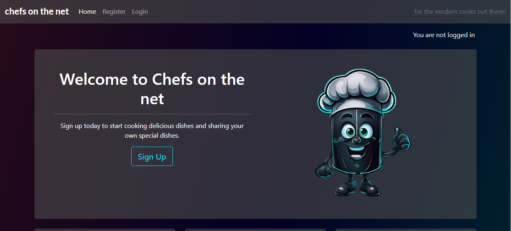
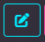
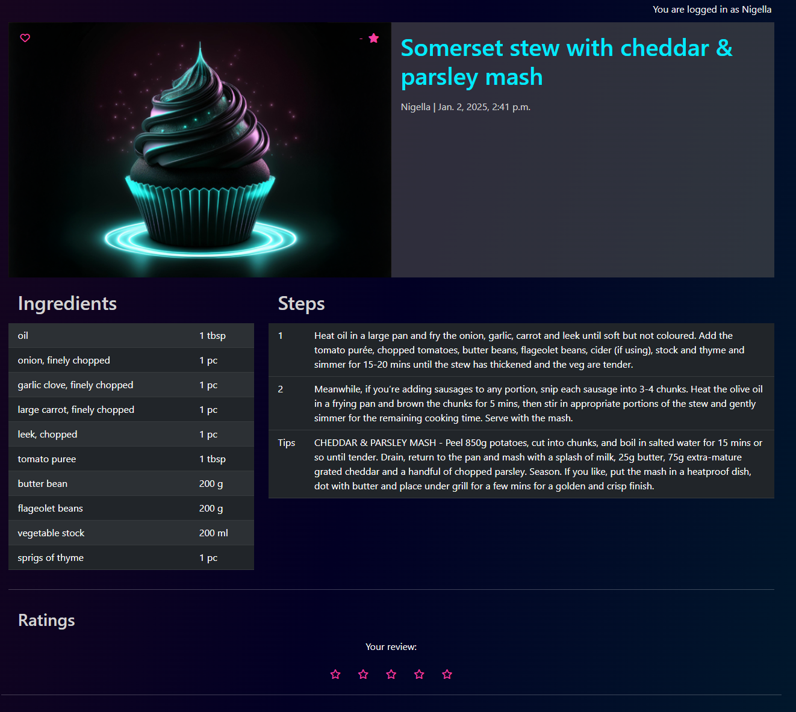

# Chefs on the net
For my fourth portfolio project with Code Institute, I built a full stack application of a digital recipe book using Django's framework.

Chefs on the net caters for the self made chefs that want to move their recipe books to a digital platform where users can collate their recipes for personal use and/or share with other users on our website. Create a community where users can can comment, rate and even personalise the recipes with their own twist. 

Only registered users have access to the recipes shared on the site and the rest of its features, such as creating recipes, submitting comments, ratings and adding recipes to their favourites.

Recipes require approval from the superuser to listing the recipe for general viewing on the site, but comments and ratings can can be approved by the recipe owners.

The home page whilst a user is logged in, will display the library of public recipes available, whilst in "My recipes" page, users can view their own recipes and more easily review comments and ratings on their recipes.


[View the deployed webapp here](https://chefs-on-the-net-08c612a798ef.herokuapp.com/)

[View the Agile project here](https://github.com/users/dasic002/projects/6)


***

## Table of contents
* [UX User Experience](#ux---user-experience)
  * [User stories](#user-stories)
  * [Strategy](#strategy)
  * [Scope](#scope)
  * [Surface](#surface)
  * [Structure](#structure)
  * [Wireframes](#wireframes)
  * [Surface](#surface)
* [Features](#features)
* [Technologies](#technologies)
* [Testing](#testing)
* [Deployment](#deployment)
* [Credits](#credits)

***
## UX - User Experience

### User stories
#### New Visitor
- Upon reaching the website I want to understand what the site does
- I want to see some content before registering
- I want to easily navigate the site to register or find social media links
- I want to easily sign up and start using the site

#### Registered User
- I want to login and logout easily
- I want to be able to delete my account
- I want to be able to reset my password should I forget it
- I want to be able to create/edit/delete my recipes
- I want to be able to create/edit/delete my comments on recipes
- I want to be able to create/edit/delete my rating on recipes
- I want to be able to add and remove a recipes from my favourites
- I want to be able to review comments and ratings from other user on my recipes
- I want to be able to easily copy an existing recipe to make my own tweaks to it
- I want to be able to submit new food items for approval should they not exist in the database

#### All Users
- I want to be able to easily navigate the site regardless of display size
- I want to get feedback on actions taken on the website
- I want to be able to contact the site admin
- I want to see recipe details when I click on it
- I want to be advised if a page I navigated to no longer exists and easily return to the site


### Strategy
Start with an MVP and build on desirable features, to create a simple and cool website the users will want to visit time and time again.

### Scope
This Project was created using the Agile methodology. It allowed me to focus on the **MUST HAVE** features before working on the following graded by the [MoSCoW Method](https://en.wikipedia.org/wiki/MoSCoW_method).

These features were planned as User stories in GitHub Issues and displayed using a [Kanban](https://en.wikipedia.org/wiki/Kanban_(development)) board template in GitHub Projects.

Each issue expands on the user intent, our Acceptance Criteatia and Tasks to build the feature.


__Must have features:__
- CLOSED - [USER STORY: draft recipe](https://github.com/dasic002/virtual_recipe_book/issues/8)
- CLOSED - [USER STORY: Approve recipes to publish](https://github.com/dasic002/virtual_recipe_book/issues/9)
- CLOSED - [USER STORY: View Paginated list of recipes](https://github.com/dasic002/virtual_recipe_book/issues/1)
- CLOSED - [USER STORY: Open Recipe](https://github.com/dasic002/virtual_recipe_book/issues/2)
- CLOSED - [USER STORY: View Comments](https://github.com/dasic002/virtual_recipe_book/issues/22)
- CLOSED - [USER STORY: User Login](https://github.com/dasic002/virtual_recipe_book/issues/4)
- CLOSED - [USER STORY: User logout](https://github.com/dasic002/virtual_recipe_book/issues/5)
- CLOSED - [USER STORY: Account registration](https://github.com/dasic002/virtual_recipe_book/issues/3)
- CLOSED - [USER STORY: Create a recipe](https://github.com/dasic002/virtual_recipe_book/issues/6)
- CLOSED - [USER STORY: Private or Public recipes](https://github.com/dasic002/virtual_recipe_book/issues/7)
- CLOSED - [USER STORY: Update existing recipe ](https://github.com/dasic002/virtual_recipe_book/issues/23)
- CLOSED - [USER STORY: Delete Recipe](https://github.com/dasic002/virtual_recipe_book/issues/24)

__Should have:__
- CLOSED - [USER STORY: Comment on recipe ](https://github.com/dasic002/virtual_recipe_book/issues/13)
- CLOSED - [USER STORY: Modify or delete comment on a recipe](https://github.com/dasic002/virtual_recipe_book/issues/15)
- IN PROGRESS - [USER STORY: Approve comments](https://github.com/dasic002/virtual_recipe_book/issues/14)
- OPEN - [USER STORY: Personalise a Recipe](https://github.com/dasic002/virtual_recipe_book/issues/11)

__Could have:__
- CLOSED - [USER STORY: View rating](https://github.com/dasic002/virtual_recipe_book/issues/17)
- OPEN - [USER STORY: Approve changed published recipes](https://github.com/dasic002/virtual_recipe_book/issues/10)
- OPEN - [USER STORY: Mark recipes as favourites](https://github.com/dasic002/virtual_recipe_book/issues/12)
- OPEN - [USER STORY: Add a rating to a recipe](https://github.com/dasic002/virtual_recipe_book/issues/16)
- OPEN - [USER STORY: Add tags to recipe](https://github.com/dasic002/virtual_recipe_book/issues/18)

__Won't have:__
- OPEN - [USER STORY: Add a recipe to weekly meal planner](https://github.com/dasic002/virtual_recipe_book/issues/19)
- OPEN - [USER STORY: Add a meal planner to grocery list](https://github.com/dasic002/virtual_recipe_book/issues/20)
- OPEN - [USER STORY: Add recipe to grocery list](https://github.com/dasic002/virtual_recipe_book/issues/21)


### Structure
A multi page including Account Management and Blog like pages to navigate and manage Recipes. The page is composed of the following sections:
- **Header** - Contains title of the page.

- **Menu** - Navigation links included in the header, but collapse into the hamburger/bars icon on smaller displays, either are always visible in the header.

- **Home** - The first page any visitor lands on, includes a banner section welcoming the visitor and inviting them to sign up, should the visitor not be logged in. The page includes 3 recipes the anonymous user is free to browse. Once the user is signed up and logged in, the same page turns into the Library of published recipes the user is able to browse. Includes Recipe widgets and Page navigation widget.

  - **Recipe widget** - Reusable section containing image, Clickable Title, description and Clickable Author name.

  - **Page navigation widget** - Reusable section containing the pagination buttons to navigate libraries of recipes.

- **My recipes** - Another Library view for recipes the current user has created. Includes Recipe widgets, Page navigation widget, Add recipe button to link the user to a Create recipe form, Edit and delete buttons within the recipe widget to allow the user to edit the recipe or delete it. Deletion of recipe requires confirmation via a modal before execution.

- **User Library** - Accessible when the user click on the author's username on the recipe widget. It forwards the user to the same view as **My Recipes** filtering with the given Author's recipes, but excludes any Add/Edit/Delete Recipe buttons.

### Wireframes
- [Landing page](docs/wireframes/01_landing_page.jpg)
- [Navbar and footer](docs/wireframes/02_navbar_and_footer.jpg)
- [Login page](docs/wireframes/03_login.jpg)
- [Signup page](docs/wireframes/04_sign_up.jpg)
- [Logout page](docs/wireframes/05_logout.jpg)
- [Recipes library page](docs/wireframes/06_recipes_library.jpg)
- [My recipes page](docs/wireframes/07_my_recipes.jpg)
- [Recipe details page](docs/wireframes/08_recipe_details.jpg)
- [New recipe page](docs/wireframes/09_new_recipe.jpg)

### Surface
#### Colour theme
Considering the theme of Chefs gone digital, was inspired too use a sort of Neon/Cyberpunk colour theme.


#### Typography
Google Fonts included:
- Roboto
- Lato

#### Icons and images
Recognisable icons sourced from [FontAwesome](https://fontawesome.com/) were used for [edit](https://fontawesome.com/icons/pen-to-square?f=classic&s=solid), [delete](https://fontawesome.com/icons/trash?f=classic&s=solid), [like](https://fontawesome.com/icons/heart?f=classic&s=regular) and [rating](https://fontawesome.com/icons/star?f=classic&s=regular) buttons as well as an accompanying image for the error pages [403](https://fontawesome.com/icons/ban?f=classic&s=solid), [404](https://fontawesome.com/icons/circle-question?f=classic&s=regular), [405](https://fontawesome.com/icons/circle-xmark?f=classic&s=regular) and [500](https://fontawesome.com/icons/link-slash?f=classic&s=solid).

Regarding images, a [placeholder image](static/images/placeholder.png) and a [mascot image](static/images/placeholder.png) was generated using [Adobe Firefly - AI image generating tool](https://www.adobe.com/uk/products/firefly.html) through Adobe Photoshop, all other images are sourced from the original recipes online.
Placeholder consists of a muffin with the sort of cyberpunk colouring, whilst the mascot is intended to be a friendly robot chef caricature.

## Features 

### Existing Features
#### Navigation Menu
The navigation as standard is set to a relative position and at the top of the page. On narrow displays, the navigational links are collapsed into an expandable hamburger icon menu, otherwise the links are displayed across the top. The Menu includes **Home** and either **Login** and **Register** or **Logout** and **My recipes** dependant on user login status. If the link belongs to the current page being viewed, that link is highlighted as active. The virtually white text over the dark background remains contrasting enough and in keeping with the cyberpunk look.
      <table>
      <tr><th>Mobile</th><th>Desktop</th></tr>
      <tr><td>
      
      </td><td>
      
      </td></tr>
      </table>

#### Home page
As viewed by an anonymous user (i.e.: not registered and logged in user) - the landing page will consist of:
  - __Welcome section__ - A simple Welcome section welcoming the visitor and inviting the user to sign up.
      <table>
      <tr><th>Mobile</th><th>Desktop</th></tr>
      <tr><td>
      
      </td><td>
      
      </td></tr>
      </table>
  - __Sample library__ - 3 sample recipes the visitor is free to explore, without access to rate, save or comment on the recipe.
      <table>
      <tr><th>Mobile</th><th>Desktop</th></tr>
      <tr><td>
      
      </td><td>
      
      </td></tr>
      </table>
As viewed by a logged in user
  - __Published Library__ - the landing page turns into the published recipes library displaying all recipes users have chosen to publish including the saved status and average rating of the recipe within the recipe card.
      <table>
      <tr><th>Mobile</th><th>Desktop</th></tr>
      <tr><td>
      
      </td><td>
      
      </td></tr>
      </table>

#### My Recipes
Once a user is logged in, the link is available in the nav menu. It navigates to a library page, listing all of the recipes the current user has created, no matter the state (**DRAFT**, **PRIVATE**, **UNLISTED** and **PUBLISHED**). In this same page, the user has access to manage their library. The page includes the recipe widget and pagination widget just like in the home page.<br>

  - __Add recipe__ - Present at the top of the page is a **Add recipe** button, click it will navigate to a blank recipe editor form.<br>
  
  - __Edit recipe__ - Present at the base of each recipe card, the **edit** button will navigate the user to the recipe editor form, pre-populated with the recipe details.<br>
   
  - __Delete recipe__ - Present at the base of each recipe card, the **delete** button will bring up a modal window to confirm the user wants to delete the given recipe from the database. Clicking delete will erase the data from the database and redirect the user to their recipe library with an alert message confirming the recipe has been deleted.<br>
  

#### Recipe editor form
The form used by the authenticated user to create a new recipe or update an existing one.<br>

The form includes the fields for:
- Title - single line text input field, for recipe title
- Description - text area input field, for an inticing excerpt describing the recipe
- Prep (Preparation) time - integer input field, for time taken, in minutes, to prepare ingredients through to the moment the dish is ready to get cooked, frozen or left to set.
- Cook (cooking) time - integer input field, for time taken, in minutes, for the dish to be cooked, frozen or set.
- Servings - integer input field, for the number of servings the recipe described supplies.
- Method - text area input field, for recording the steps taken to prepare the given dish.
- Listing type - dropdown list, selecting between the options:
  - **DRAFT** - draft recipe, details are not complete, visible only to author.
  - **PRIVATE** - ideally a complete recipe, visible only to author.
  - **UNLISTED** - ideally a complete recipe, visible to any registered user that has the direct URL.
  - **PUBLISHED** - complete recipe, ready to be shared in the published recipe available to any registered user. Requires the Admin user to approve the recipe before it appears on the published library or the user has the direct URL.
- Source - single line text input field, so the author can enter details of the origin of the recipe. i.e.: a book, grandmother, tv show.
- Source url - slug input field, so the author can enter the url for the original recipe if it was sourced online.
- Ingredient subset form - generated with Django's formsets, it is made visible on clicking "add ingredient", managed via javascript.<br>
  
  - Food item - single line text input field, to enter food item name.
  - Quantity - float number input field, set to 2 decimal points.
  - Unit - dropdown list, to select the applicable unit of measure.
  - Remove ingredient button - run with javascript to delete the ingredient form above to ignore entered data or remove the ingredient from the database.
- Submit button - to submit new recipe or changes made to existing recipe.

If the user has navigated to this page by clicking **new recipe** the form will open with blank fields ready for data entry. If navigated to by selecting a recipe to **edit**, the form will be prepopulated with the recipe data.

On successful submission, the form will create an alert messages to indicate to the user the data was successfully submitted.

#### User Library
Similarly to the My recipes page, logged in users can navigate to other users' recipe library view, by clicking on the author name of a given recipe card. This page will render all the published recipes by the given author. The title on the page will indicate the current author library in view.<br>


#### Widgets
##### Recipe widget
This reusable template renders the recipe card to display in the library views. It consists of image, title, description, Author and timestamp of recipe being added. The author username here is clickable and will take the user to the author's library to view their published recipes, however, this is only visible to logged in users and will redirect the Anonymous user to the log in page.<br>

Once the user is logged in, the widget will include the save button and rating. Where the save button indicates whether the user has saved the given recipe or not. The rating indicates the average rating given to a recipe and is a button that if clicked, will direct the user to the ratings section in the recipe details page.<br>

Finally, if the user has navigated to "My recipes" page, the recipe widget will include the edit and delete buttons as the user expects to have full managemment control of their own recipes here.<br>
      <table>
      <tr><th>Anonymous User</th><th>Logged in User</th><th>My recipes views</th></tr>
      <tr><td>
      
      </td><td>
      
      </td><td>
      
      </td></tr>
      </table>

##### Pagination widget
This reusable template renders the pagination for a given library view. Should the given library contain more than the library template allows to render in a page, in this case 6 recipes per page, the widget will include the following:
- current page out of the total number of pages available to navigate through.
- page navigation buttons needed in the current position, i.e.: page 1 of 2 will only include buttons to navigate forward pages.<br>
      <table>
      <tr><th>Single page</th><th>First page</th><th>Last page</th></tr>
      <tr><td>
      
      </td><td>
      
      </td><td>
      
      </td></tr>
      </table>

#### Recipe details
When a logged in user clicks on a recipe, the recipe will be displayed in this template, which consists of photo of the dish, title and publication details at the top, with the save button and rating average over the photo just as in the recipe widget.<br>
      <table>
      <tr><th>Mobile</th><th>Desktop</th></tr>
      <tr><td>
      
      </td><td>
      
      </td></tr>
      </table>

Followed by the recipe description, ingredients and steps.<br>
      <table>
      <tr><th>Mobile</th><th>Desktop</th></tr>
      <tr><td>
      
      </td><td>
      
      </td></tr>
      </table>

Then, the ratings section which will display the current user's review before showing the remaining reviews in a collapsible table.<br>
      <table>
      <tr><th>Mobile</th><th>Desktop</th></tr>
      <tr><td>
      
      </td><td>
      
      </td></tr>
      </table>

Finally, the comments section, which will display all approved comments on the recipe. If the current user has made comments, they will have edit and delete buttons available on their comments and should their comments be pending approval, a message will indicate so too.<br>
      <table>
      <tr><th>Mobile</th><th>Desktop</th></tr>
      <tr><td>
      
      </td><td>
      
      </td></tr>
      </table>

- __Anonymous user handling__
When the recipe details page is viewable by an anonymous user, the forms in ratings and comments sections are disabled and encourage the user to sign up or login.<br>
      <table>
      <tr><th>Mobile</th><th>Desktop</th></tr>
      <tr><td>
      
      </td><td>
      
      </td></tr>
      </table>

#### User Authentication
To add user authentication the Django Allauth package was installed. It provides our app with the capabilities to detect a user and provide real use scenarios for our CRUD functionalities. User registration, login and logout was added to our app using the views and templates provided with Allauth.<br>
- __Registration__<br>

- __Login__<br>

- __Logout__<br>

- __Further controls__
  - Only one superuser has been created and has access to the admin control panel, this was to prevent the risk of granting too much access to users and creating a more labour intensive user admin, as with each new user registration, the superuser would need to login and grant access to the new user. Whereas, it is better if all the controls users need are available within the frontend interface.
  - Django login required mixin was added to limit what access Anonymous users have and redirect them to the login page automatically. This function adds forwards the user to the intended URL once they have logged in. 
  - Otherwise, our code does verify the user is authenticated and has the rights to access a given page and will redirect to the relevant error responses as appropriate.

#### Alert messages
Alert messages have been enabled to provide the user with feedback on actions taken, be it notify of successfull registration, login, logout, recipe or comment created, edited or deleted.<br>


#### HTTP Error pages
Bespoke error pages for codes 403, 404, 405 and 500 have been created to fit within the style of the website and provide easy access to the navigation so the user can get back to an accessible page of the site.
- __403__<br>

- __404__<br>

- __405__<br>

- __500__<br>


### Features Left to Implement
Due to personal time constraints the following features were not implemented so I did not get distracted with a feature creep and not deliver on my MVP.

#### <ins>Recipe form - image upload</ins>
The recipe form was meant to include fields for every detail the recipe creator would expect to include. An enticing picture is often expected to capture the readers' interest, and for ease of creating the recipe, the frontend form should have included a field for this image upload. However, as much as it was tried, every time the field was included in the form, it never uploaded the image and the form this not see the field as valid spite having selected a photo to upload.

A how to guide from Cloudinary was followed, but after spending a few hours trying to implement this feature, the field was removed for now so that at least the recipe could be created. In the meantime, users were granted staff status and access to edit recipes through the admin panel. This is not optimal, as any of these users can modify another creator's recipe, but it would allow the user to upload an image.

>__How might we create this?__<br>
>I'd need to revisit the how to guide by Cloudinary, perhaps replicate their project exactly to prove it works and further research to see if other users have had a similar struggle and found a solution.

>[Cloudinary Docs - Manage images in a Django app](https://cloudinary.com/documentation/django_helper_methods_tutorial)

#### <ins>Recipe form - Steps/Method recorded as JSON</ins>
For a cleaner view of the recipe steps, the steps were meant to be recorded as a JSON so it could be easily rendered into as a list view in a table. It is a feature commonly seen in other cooking sites and as a person that often cooks referring to a recipe on my phone, it is very helpful to folllow it this way.<br>



I got to the point of rendering this in the recipe detail view, by manually entering the steps in a JSON format in the form, but this isn't very user friendly and I ran out of time to implement a better interface. The idea was to create a Steps/Method formset with add and remove buttons, similar to what was done with the ingredients form. The user would be able to simply write the steps in clean text in each separate field and the form would collate and convert it into JSON to save in the model.

>__How might we create this?__<br>
>I suspect it would involve creating a new inline formset for a textarea field and link it to a Django library to handle JSON files, then having javascript to dynamically add and remove fields as the user creates or edits a recipe. Likely using this python method [json.loads()](https://www.geeksforgeeks.org/json-loads-in-python/).

>A fallback option would be, to keep the Method field in the recipe form, but have javascript hide it from the user. The script still creates the dynamically added and removed fields, but on submit, javascript collates the text entered as JSON and places it into the hidden field to save into the model. When the user wishes to edit the recipe and the prepopulated form is rendered, the script can iterate through the JSON content of the hidden field and render it into the extended step fields. This option does feels labour intensive and believe there must be a library that handles this already and mitigates for converting text that may include apostrophes or double quotes when placing it into the JSON values.

#### <ins>Comment approval within Recipe</ins>
This feature would allow the recipe creator to navigate to a given recipe of their making and as they scroll down the list of comments, those marked for review would display Approve and Reject buttons.

The Approve button would simply approve and enable public viewing of the comment. Whereas, the Reject button would pop up a form with a text field, to allow the recipe creator to provide feedback as to why the comment was rejected. In the Django view, on rejection, it will manipulate the text entry to include:
- Original comment.
- Template message stating the comment was rejected, e.g.: ----REJECTED on {date and time}----
- Reviewer's response text.

The text field for the reviewer's response would be prepopulated with a standard short reminder for users to be polite and considerate, but the reviewer can opt to erase this if not applicable. The reviewer can only edit their response, not the original comment or the reject template.

The whole text in the comment (including reviewer's text) can be edited by the commenter still and on submission it is set to review status again.

>__How might we create this?__<br>
>Firstly, every comment made in the given recipe would need to be visible to the recipe author to review, so the recipe detail template would need to check if the current user is the recipe author, and if so display all comments for the recipe. Then, if given comment is pending review add buttons and hidden form, with a data values to recall the comment instance.

> Create a javascript to detect the clicking of the reject button, make the comment review form visible and perhaps bring up a Modal to confirm the reviewer wants to continue with the comment rejection as they will not have a chance to edit their review again.

> On confirming comment rejection, a POST request is made and the form handling in the view will append the template rejection marker text followed by the reviewer response. As well as marking the comment as rejected.

>The django template would also need to be updated to display rejected comments in the same way pending review comments are shown, except include a message that the comment needs to be revised. The comment author can edit it the same way they edit any other comment.

>Similar to the image upload field issue, whilst this feature has not been built, users have been granted access to edit comments in the admin panel, but this seems a little redundant when everyone has access to each others' comments, regardless of recipe authors. I've not had a chance to see if there is a way of filtering access to edit comments in the admin panel by whether the user is the author of a given recipe.


#### <ins>Recipe saving</ins>
Similar to bookmarking sites as you browse, this feature would allow users to toggle saving a recipe the user likes the sound of and wishes to try making it later, by simply clicking on the heart icon button over the recipe photo. The site has the button to render the sample likes added via the admin page, but it is not setup as frontend form yet.

>__How might we create this?__<br>
>Essentially as a simplified version of the comment form linked up to the "Favourite" model. Upon visiting a new recipe, the button is set to "not saved" (visible as heart outline icon) after the relevant view has queried the model and found no records of the current user ever liking the given recipe. The save "heart" button would be the submit button of its own form. 

>The code for the POST method in the recipe detail view would need to change to distinguish between the which "submit" button triggered it, then the recipe save form would take current recipe and user as parameters to add entry to the model. The user is redirected back to the page and the save button is changed to solid icon as an entry is visible. 

>Now there is recipe save entry, the button will call a url specific to delete this entry and redirected back to the page to render it back as a heart outline icon button to submit a new recipe save entry should the user change their mind again.

#### <ins>Recipe rating</ins>
Similar to the recipe save button, the feature would allow the user to select the number of stars they'd like to rate the recipe with, simply clicking on the star would submit their rating.

Additionally, the user could click a button to add or edit a review to make a rating form visible, which would contain simply a text field and a submit button.

A delete button, would delete the whole rating instance, whether it included a text review or not.

A nice touch for User Experience would be to add a script to detect hovering over a star icon button and display lower rating buttons as being hovered too. i.e.: in a row of 5 buttons, when the user hovers over the 3rd button, the buttons on the left for 1-star and 2-stars ratings would highlight too, so the user understands clicking this button will submit a 3-stars rating.

Star ratings would be visible, whilst the rating is marked as review or approved, but not is rejected. The review will only be made visible on approved state. The idea is that users cannot use this feature to bypass verification to be offensive or dishonest.

>__How might we create this?__<br>
>The django template to render the rating and review has been included already, but to add the function of the frontend form I would have to include:
>- similar code to the recipe saving to operate the star buttons.
>- similar form like what has been done for adding comments.
>- adding the javascript to handle the hover state of multiple buttons and copying the text into the form in the same way comments are edited.

#### <ins>Personalise a Recipe</ins>
This feature would enable users to create a copy of a given recipe to add their own twist, for instance to perhaps make a meat containing dish vegetarian, vegan or easier to make.

When a user navigates to a published recipe, a button to personalise the recipe would be available, it would open the recipe create form prepopulated with the given recipe details ready for the user to modify. On submitting the form, the details are saved in a new instance with the changes made and the current user as the author.

>__How might we create this?__<br>
>Presumably something like recipe_create but fetching the recipe instance and setting the recipe form and ingredient form to given instance. However, on POST request method being called, it saves as a new instance, just like in the recipe_create. Automatically, adding the referenced recipe details in the model fields for Origin, Source and Source URL. Perhaps even appending a template message at the base of the description that the recipe is based on previous recipe with a link to view original.

#### <ins>Add tags to recipes</ins>
As many cooking sites include, this feature would present as clickable keywords that describe the recipe, such like vegetarian or lunch. So the user can navigate the library filtering the recipes by a given keyword.

These keywords would be available as buttons in the recipe library or inside the recipe detail page, when the user clicks on them, it redirects the user to the library with a view of all recipes including such tag.

>__How might we create this?__<br>
>Would need to create 2 new models:
>- One to keep track of a list of unique tag keywords.
>- Another to track the links of those keywords to recipes, since it is a many to many relation.

>Then, setting up new URL, probably `/<slug:tag>/` and linking it to the RecipeLibrary view, passing it the keyword used as the tag variable and using it to filter the recipe queryset to those linked to that keyword.

>I suspect that the RecipeLibrary view cannot be reused, so a new one specific for presenting tag filtered library would be created and called upon with the URL.


### Data Models
Chefs on the Net app uses a relational database to store and manage data. The relational database management system software used was PostgreSQL and was hosted on [Code Institute service](https://dbs.ci-dbs.net/).

#### <ins>Model - Recipe</ins>
Model to record recipe details.

**Title** - CharField, maximum length of 50 characters that must be unique.

**Slug** - SlugField, maximum length of 50 characters that must be unique and not save as Null.
- To automatically generate the slug from the title created, this article [Slugify](https://learndjango.com/tutorials/django-slug-tutorial#:~:text=populated.%20Pretty%20neat!-,Signals%2C%20Lifecycle%20Hooks%2C%20Save%2C%20and%20Forms/Serializers,-In%20the%20real) was followed to implement this function on form submission.

**Author** - ForeignKey, links up to the built-in User model, can be blank and and set to Null. 
- Should a User be deleted, the recipe author will preset to Null, so we avoid deleting recipes other users like and the deleted user doesn't mind leaving them on the site on account deletion.

**Feature_image** - CloudinaryField, stores the url to the image uploaded to Cloudinary server.

**Description** - TextField, for user to describe the dish to entice readers.

**Prep_time** - PositiveIntegerField, default of 1, this field records the time taken, in minutes, to prepare ingredients before cooking.

**Cook_time** - PositiveIntegerField, default of 1, this field records the time taken, in minutes, to cook/heat/fry/bake/freeze the meal.

**Servings** - PositiveIntegerField, default of 1, this field records number of servings the recipe described provides.

**Method** - TextField, to write the steps to prepare the dish.

**Listing_type** - IntegerField, to take choices 0:Draft, 1:Private, 2:Unlisted, 3:Published.
- Draft - the user creates a draft recipe, not ready for sharing or in a useful state.
- Private - the user does not wish to share the recipe with anyone, just for personal use.
- Unlisted - the user wishes to share the link to their recipe with other users that have the direct URL.
- Published - the user wishes to share the recipe with all users on the site and have it listed in the common library.

**Approved** - IntegerField to take choices 0:Review, 1:Rejected and 2:Approved.
- Review - when the recipe has been submitted to be published, the site admin must review to ensure there is no offensive language used or misleading information.
- Rejected - Site admin deemed recipe inappropriate to publish on the site.
- Approved - Site admin approved recipe for publishing on the site.

**Origin** - ForeignKey, links to another recipe on the model that a given recipe is based off. Since recipes may be sourced outside of chefs on the net, this field can be left blank and set to null.

**Source** - CharField, maximum length of 250, but can be left blank. Included so creator can make reference to recipe origin, perhaps from a book or friend.

**Source_url** - URLField, maximum length of 250, can be left blank. Included so creator can make reference to recipe origin if sourced online.

**Created_on** - DateTimeField, automatically adds the timestamp at time of entry.

**Updated_on** - DateTimeField, automatically adds a timestamp at the time a change is made.


#### <ins>Model - Ingredient</ins>
Ingredients were placed in a separate model so it was easier to implement another model later in the project to generate a dictionary of food items and make it easier to consolidate ingredients in a grocery lists when users add recipes to their meal plan.

**Recipe** - ForeignKey, links to the recipe on the Recipe model to which this ingredient instance belongs to.
- Should a recipe be deleted, the record of this given Ingredient instance will be deleted.

**Food_item** - CharField, records the name of the food item.

**Quantity** - DecimalField, field to record the number for a food item measure, format set to 999.99, so up to 3 digits whole number and 2 decimal places. Helpful when trying to record halves, quarters and all else in between.

**Unit** - IntegerField to take choices of unit of measurements, with the default set to 0:Piece.
- 0:piece - PIECE
- 1:stick - STICK
- 2:mg - MILLIGRAM
- 3:g - GRAM
- 4:kg - KILOGRAM
- 5:oz - OUNCE
- 6:lb - POUND
- 7:ml - MILLILITERS
- 8:cl - CENTILITERS
- 9:l - LITERS
- 10:tsp - TEASPOON
- 11:tbsp - TABLESPOON
- 12:floz - FLUID_OUNCE
- 13:cup - CUP
- 14:pint - PINT
- 15:quart - QUART
- 16:gallon - GALLON


#### <ins>Model - Comment</ins>
Model to record user comments on any given recipe.

**Recipe** - ForeignKey, links to the recipe on the Recipe model to which this comment instance belongs to.
- Should a recipe be deleted, the record of this given comment instance will be deleted.

**Author** - ForeignKey, links up to the built-in User model, can be blank and and set to Null. 
- Should a User be deleted, the commenter will preset to Null, so we avoid deleting the comment/recipe feedback other users may find useful.

**Body** - TextField, body of text for the comment.

**Approved** - IntegerField to take choices 0:Review, 1:Rejected and 2:Approved.
- Review - when the comment has been made, the site admin or recipe owner must review to ensure there is no offensive language used or misleading information.
- Rejected - Site admin or recipe owner has deemed the comment inappropriate to publish on the site.
- Approved - Site admin or recipe owner approved comment for publishing on the site.

**Created_on** - DateTimeField, automatically adds the timestamp at time of entry.


#### <ins>Model - Rating</ins>
Model to record the rating and reviews users provide on a given recipe.

**Recipe** - ForeignKey, links to the recipe on the Recipe model to which this rating instance belongs to.
- Should a recipe be deleted, the record of this given Rating instance will be deleted.

**Score** - IntegerField, to record a score as a number between 1 and 5. default is 0.

**Review** - CharField, maximum length of 250 and can be left blank.

**Author** - ForeignKey, links up to the built-in User model, can be blank and and set to Null. 
- Should a User be deleted, the reviewer will preset to Null, so we avoid deleting the recipe rating instance other users may find useful.

**Approved** - IntegerField to take choices 0:Review, 1:Rejected and 2:Approved.
- Review - when the review has been made, the site admin or recipe owner must review to ensure there is no offensive language used or misleading information.
- Rejected - Site admin or recipe owner has deemed the review inappropriate to publish on the site.
- Approved - Site admin or recipe owner approved the review for publishing on the site.

**Created_on** - DateTimeField, automatically adds the timestamp at time of entry.


#### <ins>Model - Favourite</ins>
Model to record the instances the user saves a given recipe as a favourite.

**Recipe** - ForeignKey, links to the recipe on the Recipe model to which this favourite instance refers to.
- Should a recipe be deleted, the record of this given Favourite instance will be deleted.

**Author** - ForeignKey, links up to the built-in User model. 
- Should a User be deleted, the record of this given Favourite instance will be deleted.

**Added_on** - DateTimeField, automatically adds the timestamp at time of entry.


#### <ins>Entity Relationship Diagram</ins>
In this ERD we can see the models created and how they are related to one another.


## Technologies used
- Languages:
  - [HTML5](https://en.wikipedia.org/wiki/HTML5)
  - [CSS3](https://en.wikipedia.org/wiki/CSS)
  - [JavaScript](https://en.wikipedia.org/wiki/JavaScript)
  - [Python](https://en.wikipedia.org/wiki/Python_(programming_language))
- Frameworks, Libraries and Packages:
  - [Bootstrap 5](https://getbootstrap.com/docs/5.0/getting-started/introduction/)
  - [Django 5.0](https://docs.djangoproject.com/en/5.0/)
  - [Django-AllAuth](https://docs.allauth.org/en/latest/installation/quickstart.html)
  - [Django-Crispy-forms](https://django-crispy-forms.readthedocs.io/en/latest/install.html)
  - [Django-Summernote](https://github.com/lqez/django-summernote)
  - [Google Fonts](https://fonts.google.com/)
  - [FontAwesome](https://fontawesome.com)
- Tools:
  - [Draw.io](https://app.diagrams.net/#) - a free web-based diagram drawing tool.
  - [GitPod](https://www.gitpod.io/) - Cloud-based IDE to edit code and Git version control.
  - [GitHub](https://github.com/) - to store and publish the project.
  - [Heroku](https://dashboard.heroku.com/) - for deployment of our web app.
  - [Cloudinary](https://cloudinary.com/) - to host images on the cloud server.
  - [Database maker by CodeInstitute](https://dbs.ci-dbs.net) - the PostgreSQL hosting by CodeInstitute.
  - [Google Chrome DevTools](https://developer.chrome.com/docs/devtools/) - Chrome's developer tools to inspect your project as rendered in the browser.
  - [Favicon](https://favicon.io/) - to generate the favicon for the site.
  - [Am I Responsive](https://ui.dev/amiresponsive) - to visualise the website in various display sizes.
  - [PEP8 guide](https://peps.python.org/pep-0008/) - for guidance on python formatting standards. 
  - [W3C Markup Validation](https://validator.w3.org/) - to validate the HTML code.
  - [W3C CSS Validation](https://jigsaw.w3.org/css-validator/) - to validate the CSS code.
  - [JSHint](https://jshint.com/) - to check JavaScript code.
  - [Code Institute's Python linter](https://pep8ci.herokuapp.com/) - to validate the Python code.

## Testing 

### Validator Testing 

- HTML
  - No errors were returned when passing through the official, just warnings on use of aria-labels on span elements. These span elements are the cards in the first step of the "How To Play" breaking down the value each card has, aria labels were added to make the site more accessible with the ability to describe the value of the card. [W3C validator](https://validator.w3.org/nu/)<br>
  
- CSS
  - No errors were found when passing through the official [(Jigsaw) validator](https://jigsaw.w3.org/css-validator/)<br>
   
- JavaScript
  - No errors were found when passing through [JS hint error checker](https://jshint.com/)<br>
  
- Python
  - No errors were found [Code Institute's Python linter](https://pep8ci.herokuapp.com/) - to validate the Python code.<br>
  

- Accessibility
  - Running the site through lighthouse analysis does show some issues with some insuficient colour contrast and performance suggests I should minimise my JS files for faster loading. Otherwise still rates above 90 on accessibility:
    - Mobile:<br>
  
 
    - Desktop:<br>
  

  - Running the site through [WAVE accessibility tool](https://wave.webaim.org/report#/https://dasic002.github.io/GameOfKings/index.html) showed no obvious errors after some improvements were made.<br>
  


### Manual Testing

#### Devices and browsers used
- iPhone 12 Pro - iOS 18.1.1
  - Safari (v18.1.1)
  - Chrome (v131)

- iPad Pro (12.9 inch - 4th Gen) - iPadOS 18.1.1
  - Safari (v18.1.1)
  - Chrome (v131)

- Dell Precision 3510 laptop - Windows 10 Pro (2H22)
  - Chrome (v131)

#### Manual testing checklist

| Feature | Action | Expected Behaviour | Pass/Fail | Notes |
|-|-|-|-|-|
|Google fonts|Loading the page|Google fonts load|PASS|
|Font awesome icons|Loading the page|Icons appear as intended|PASS|
|Images|Loading the page|images appear as intended|PASS|
|content text |Loading the page|text appears as intended|PASS|
|Nav bar appearance|Loading the page|Nav bar appears as expected, collapsed hamburger icon for narrow displays|PASS|
|Nav Button - hamburger icon|Click Hamburger icon|hamburger icon toggles to reveal and collapse nav menu|PASS|
|Nav button - Register|Click button "Register" just after loading the site|Loads sign up page|PASS|
|Nav button - Login|Click button "Login" just after loading the site|Loads login page|PASS|
|Nav button - Logout|Click button "Logout" after starting a game|Loads logout confirmation page|PASS|
|Nav Button - Logout|Click button "Sign out"|Confirms logging out and returns to Home page|PASS|
|Nav Button - Home|Click button "Home"|Loads to Home as either welcome or library dependant on login status|PASS|
|Nav Button - My Recipes|Click button "My Recipes"|Loads Logged in user's recipe library to view and manage their recipes|PASS|
|Page scaling - mobile|Viewing the page on mobile display in portrait|Font size is legible and the page does not require scrolling on timed buttons. No overlapping text or images.|PASS|
|Page scaling - mobile|Viewing the page on mobile display in landscape|Font size scales down to fit in the height of the display. Page includes left and right margins to keep content in the centre still.|PASS|
|Page scaling - desktop|Viewing the page on a desktop/laptop display in landscape with the browser taking the width of the display|Font size scales down to fit in the height of the display. Page includes left and right margins to keep content in the centre still.|PASS|
|Page scaling - desktop|Viewing the page on a desktop/laptop display in landscape with the browser taking the width of the display|Font size scales down to fit in the height of the display. Page includes left and right margins to keep content in the centre still.|PASS|
|Error 403 page|Enter existing url user is not allowed to access for the site|Calls up custom 403.html|PASS|
|Error 403 page|Click on the Home button|Brings viewer back to main page|PASS|
|Error 404 page|Enter non-existing url for the site|Calls up custom 404.html|PASS|
|Error 404 page|Click on the Home button|Brings viewer back to main page|PASS|
|Error 500 page|Browse site when a function in view has been disabled|Calls up custom 500.html|PASS|
|Error 500 page|Click on the Home button|Brings viewer back to main page|PASS|


### Bugs

- __Images uploading to Cloudinary via frontend form - OUTSTANDING__<br>
After setting up the model to include cloudinary library and field and even following an implementation guide from cloudinary, the recipe editor form would not recognise there was a file selected in the form to upload, so it always failed the form validation on submission. I removed the field from the formset so the form could still be used for MVP until I could figure out how to make it work.


## Deployment
### Local Development

#### Forking the Repository

- Log in to GitHub.
- Go to the repository for this project (<https://github.com/dasic002/virtual_recipe_book>).
- In the top-right corner of the page, click "Fork".
- Under "Owner", select an owner for the repository from the dropdown menu.
- Optionally, in the "Description" field, type a description of your fork.
- To copy the main branch only, select the "Copy the main branch only" check box. If you do not select this option, all branches will be copied into the new fork.
- Click "Create fork"

#### Cloning Your Forked Repository

- Log-in to GitHub.com, navigate to your fork of the repository.
- Above the list of files, click Code.
- Copy the URL for the repository.
  - To clone the repository using HTTPS, under "Clone with HTTPS", click the "Copy" icon.
  - To clone the repository using an SSH key, including a certificate issued by your organization's SSH certificate authority, click SSH, then click the "Copy" icon.
  - To clone a repository using GitHub CLI, click Use GitHub CLI, then click the "Copy" icon.
- Open Git Bash
- Change the current working directory to the location where you want the cloned directory.
- Type git clone, and then paste the URL you copied earlier.
- Press Enter. Your local clone will be created.

For more details about forking and cloning a repository, please refer to [GitHub documentation](https://docs.github.com/en/get-started/quickstart/fork-a-repo).

#### Install Dependencies

Use the `pip install -r requirements.txt` command to install all of the Python modules and packages listed in your requirements.txt file.

#### Create your env.py

- In your project workspace, create a file called env.py and make sure this file is included in the .gitignore file.
- Add the following code:

```python
import os

os.environ["DATABASE_URL"]='<copiedURL>'
os.environ['SECRET_KEY'] = '<ADD YOUR SECRET KEY HERE>'
os.environ['CLOUDINARY_URL'] = '<API ENVIRONEMENT VARIABLE>'

```

- Replace `<ADD YOUR SECRET KEY HERE>` in the SECRET_KEY environment variable with your own secret key.
- Save the file.

#### Create a Database
##### Via Code Institute's database maker
If you are a current student of Code Institute, you should have access to their [database maker service](https://dbs.ci-dbs.net)
- Enter your email address linked to your LMS Portal.
- The database will be generated and an email with the details will be sent to you.
- The email will contain a management URL that is unique to you and will offer the options to view details for linking to your project or delete the database.

##### Via ElephantSQL
- Create an account and log in with ElephantSQL.com.
- From the dashboard click Create New Instance.
- Set up your plan
  - Give your plan a Name
  - Select a plan tier
  - You can leave the Tags field blank
- Select Select Region
- Select a data center near you
- Then click Review
- Check your details are correct and then click Create instance
- Return to the ElephantSQL dashboard and click on the database instance name for this project
- In the URL section, click the copy icon to copy the database URL
- In your env.py file replace `<copiedURL>` in the DATABASE_URL environment variable with the copied URL.
- Save the file.

#### Set Up Cloudinary

- Create an account and log in with Cloudinary.com.
- In the dashboard copy your API Environment variable.
- In your env.py file replace `<API ENVIRONMENT VARIABLE>` in the CLOUDINARY_URL environment variable with the copied API Environment variable.
- Save the file.

### Deployment

- The requirements.txt file in the project was updated to include details on the project dependencies. Steps to do this are :
  - Enter the following command at the terminal prompt : "pip3 freeze > requirements.txt"
  - Commit changes to requirements.txt and push to GitHub.
- In `setting.py`, add Heroku Hostname to ALLOWED_HOSTS.

```python
ALLOWED_HOSTS = ["PROJECT_NAME.herokuapp.com", "YOUR_HOSTNAME"]
```

- Make sure a file named Procfile exists on the top level directory which contans the following code:

```python
web: gunicorn PROJECT_NAME.wsgi
```

- Commit changes and push to GitHub.
- Log in to Heroku, create an account if necessary.
- From the Heroku dashboard, click "Create new app". For a new account a button will be displayed on screen, if you already have one or more apps created a link to this function is located in the "New" dropdown menu at the top right of the screen.
- On the Create New App page, enter a unique name for the application and select region. Then click Create app.
- Select the "settings" tab and click the "Reveal Config Vars" button.
- Enter the following values into the specified fields and click "Add":

    | KEY | VALUE |
    |-----|-------|
    | CLOUDINARY_URL | paste your API Environment variable copied from the Cloudinary dashboard |
    | DATABASE_URL | paste the URL copied from ElephantSQL dashboard |
    | SECRET_KEY | paste your secret key |

- Select the "Deploy" tab.
- Select GitHub as the Deployment Method and click "Connect to GitHub".
- Enter the name of your GitHub repository in the search bar and click "Search".
- Click the "Connect" button to link your GitHub repository with your Heroku app.
- Scroll down the page and choose to either Automatically Deploy each time changes are pushed to GitHub, or Manually deploy.
- The application can be run from the Application Configuration page by clicking on the Open App button.

## Credits 

### Content
- Recipes - A few sourced from [BBC Good Food](https://www.bbcgoodfood.com/) and some loosely written by the developper.

### Media
- [Am I Responsive](https://ui.dev/amiresponsive) - to visualise the website in various display sizes as the preview used in this readme file.
- [Favicon](https://favicon.io/) - to generate the favicon for the site.
- [Cheese on toast image](https://www.happyveggiekitchen.com/air-fryer-cheese-on-toast/) - sourced a more appealing image of this classic staple dish

### Code
- Article on auto-generating slug from field - [Slugify](https://learndjango.com/tutorials/django-slug-tutorial#:~:text=populated.%20Pretty%20neat!-,Signals%2C%20Lifecycle%20Hooks%2C%20Save%2C%20and%20Forms/Serializers,-In%20the%20real)
- Forms - using inline forms - [Django Docs](https://docs.djangoproject.com/en/5.1/topics/forms/modelforms/#inline-formsets)
- Forms - dynamically more entries - [YouTube](https://www.youtube.com/watch?v=s3T-w2jhDHE)
- Forms - dynamically add forms - [Brennan T](https://www.brennantymrak.com/articles/django-dynamic-formsets-javascript)
- Forms - populate form to update record - [stackoverflow](https://stackoverflow.com/questions/70682238/django-how-to-auto-populate-existing-data-in-django-form-while-updating)
- Forms - making use of the formset can_delete, using **.deleted_objects** for ingredients in recipe edit view - [django docs](https://docs.djangoproject.com/en/5.0/topics/forms/formsets/#can-delete)
- Forms - Overriding the default fields, guide for comment form - [django docs](https://docs.djangoproject.com/en/5.1/topics/forms/modelforms/#overriding-the-default-fields)
- Models - ON_DELETE options - [geeksforgeeks.org](https://www.geeksforgeeks.org/foreign-keys-on_delete-option-in-django-models/)
- Models - PositiveIntegerField - [stackoverflow](https://stackoverflow.com/questions/42425933/how-do-i-set-a-default-max-and-min-value-for-an-integerfield-django)
- Models - Referring to another instance, used for recipe Origin field - [stackoverflow](https://stackoverflow.com/questions/4910905/in-django-how-do-you-make-a-model-refer-to-itself)
- Views - guidance on using Paginator in function based view - [stackoverflow](https://stackoverflow.com/questions/64170923/pagination-in-function-based-view-shows-all-objects)
- Views - guide on Paginator - [django docs](https://docs.djangoproject.com/en/5.0/topics/pagination/#using-paginator-in-a-view-function)
- Template - guidance on how to iterate over a specified number of turns, used to display the star rating buttons - [stackoverflow](https://stackoverflow.com/questions/48637178/do-django-templates-allow-for-range-in-for-loops)
- Template language - include function, used to work with repeated widgets - [stackoverflow](https://stackoverflow.com/questions/41397427/can-multiple-templates-be-extended-by-one-template-in-django)
- Script - managing comments, follows the Codestar blog walkthrough project - in this project it can be seen in [recipe-detail.js](static/js/recipe-detail.js)
- Favicon - guidance on adding a favicon to django projects - [learnDjango](https://learndjango.com/tutorials/django-favicon-tutorial#:~:text=3.-,Add%20the%20Favicon,can%20help%20with%20higher%20resolution.)
- CSS Overflow - used to make the recipe cards a consistent size and crop description if too long - [stackoverflow](https://stackoverflow.com/questions/32134117/how-to-set-limit-for-words-in-bootstrap)
- CSS - customising the details elements used for password advice and ratings conciseness - [sitepoint](https://www.sitepoint.com/style-html-details-element/)
- Python - how to use statistics.mean() method - [w3schools](https://www.w3schools.com/python/ref_stat_mean.asp)
- HTML Meta - specify browser head background colour - [Medium](https://medium.com/@evkirkiles/coloring-the-webkit-browser-bars-28d75cd8cf7f)

### Acknowledgement
- My mentor Brian Macharia for his insight, guidance and words of encouragement.
